<h1> Warcry Companion Guide</h1>

The following guides will show you step by step how to do everything in the app. There will be references to the bottom action bar. If you can not see it do not worry it is only showing on narrow screens.

You can access the application via [this link](https://smitdcatchy.github.io/warcry-companion/).

---

  
Warbands Guide

---
  To add a warband you should be on the Main screen. If you haven't added a warband yet there are green buttons to create and to import a warband.
  If you have already added a warband you can open the screen menu at the top right corner and select the create or import warband options.
  On the bottom action bar the button in the middle also lets you create a new warband.
  
  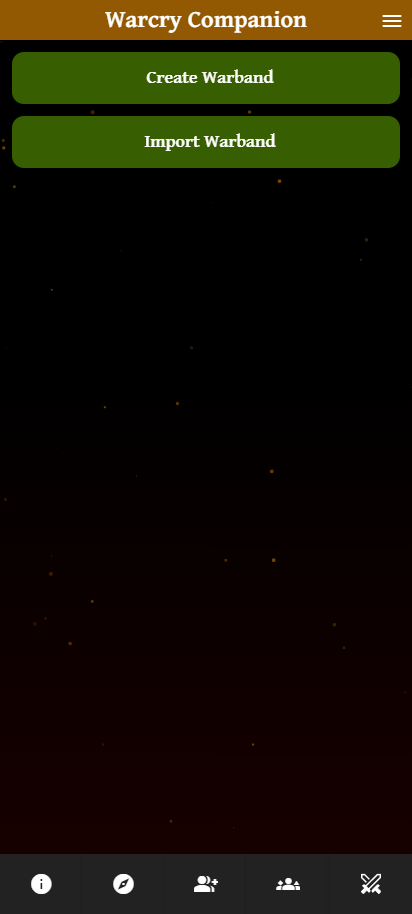 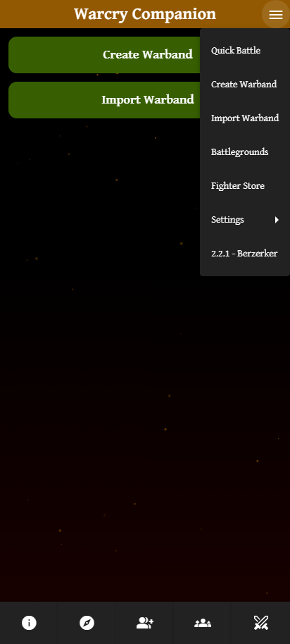

  If you select to create a warband the Warband dialog will show up. Now you will need to fill in the form with your warband's properties. You can also add an icon to your warband by pressing on the upload icon on the top left.
  
  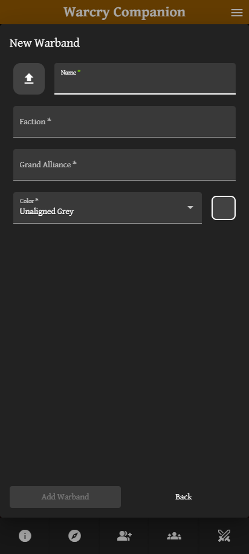 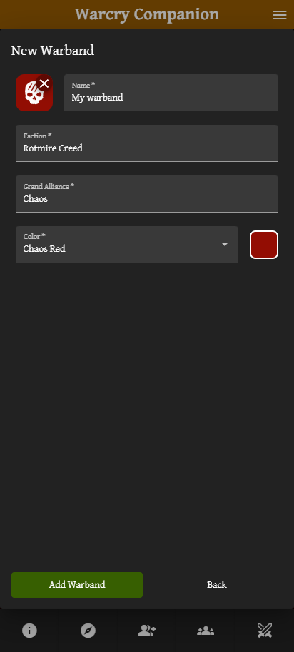

  After adding the warband its Warband card will appear on the Main screen. You can select it by pressing on the card and it will navigate you to the Warband screen showing the selected warband. You can bring up the Warband card options by pressing on the options icon (three vertical dots) on the right side of the card.

  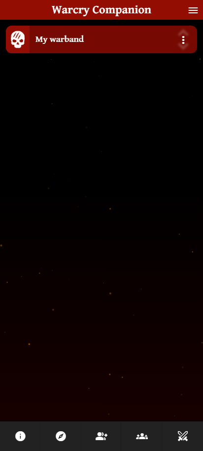 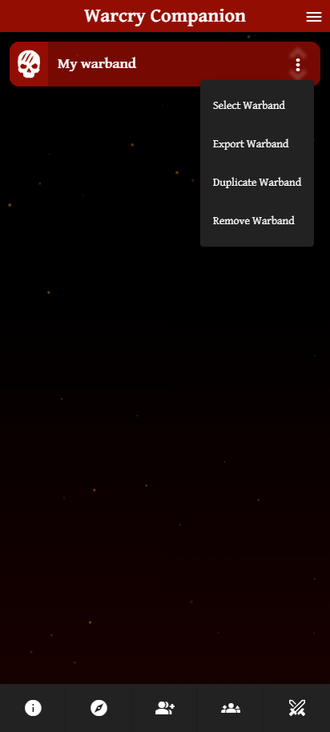

  You can select/export/duplicate/remove the warband by pressing on the corresponding Warband card option.

  If you have multiple warbands you can also change the order of the Warband cards by dragging them by their options icon.

---

  
Fighters Guide

---
  To add a fighter to a warband you should be on the Warband screen under the Fighters tab. If you haven't added a fighter to the warband yet there is a green button to add a fighter.
  If you have already added a fighter you can open the screen menu at the top right corner and select the add fighter option.
  On the bottom action bar the button in the middle also lets you add a new fighter.
  
  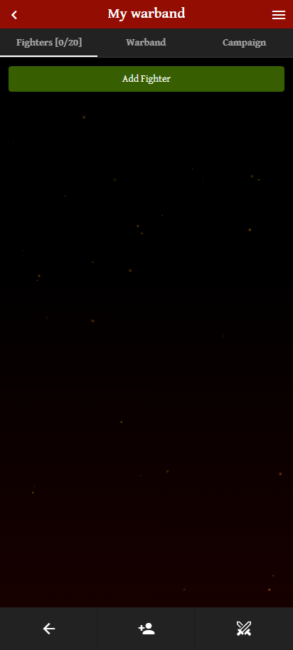 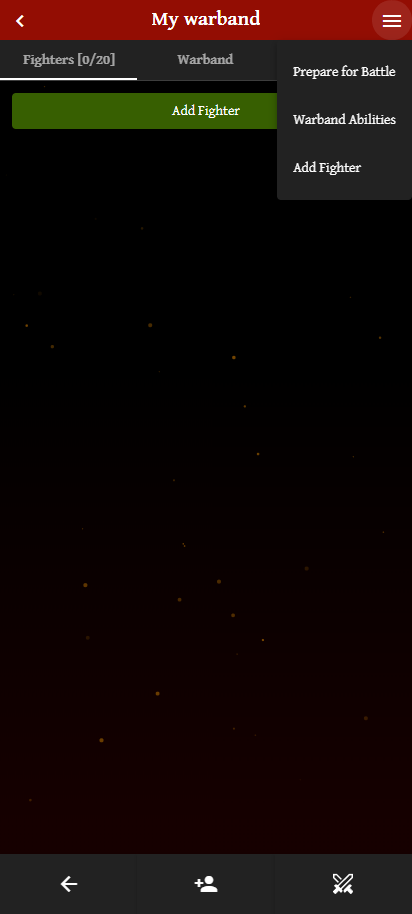

  If you select to add a fighter to the warband the Fighter dialog will show up. Now you will need to fill in the form with your fighter's properties. You can add an icon to your fighter by pressing on the upload icon on the top left. You can add a secondary weapon to the fighter by pressing the button on the bottom of the form. If you don't want the fighter to have a secondary weapon you can remove it by pressing the button on the bottom of the form.
  
  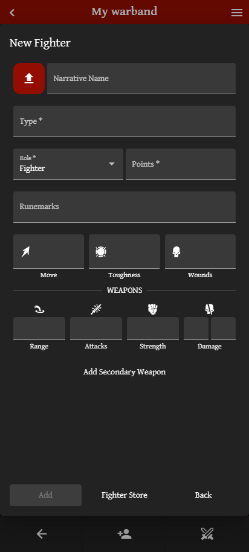 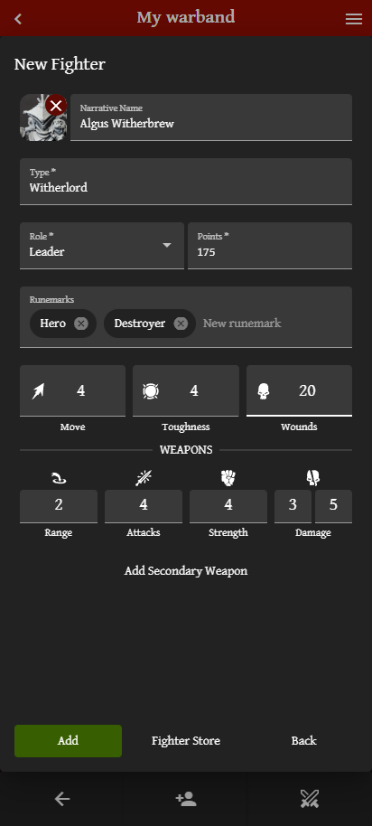

  Once the fighter has been added its Fighter card will appear on the Warband screen under the Fighters tab. You can expand it by pressing on the card and it will show you the characteristics, runemarks, weapons and other properties of the fighter.

  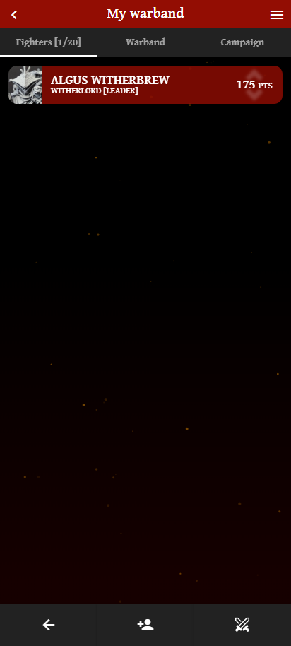 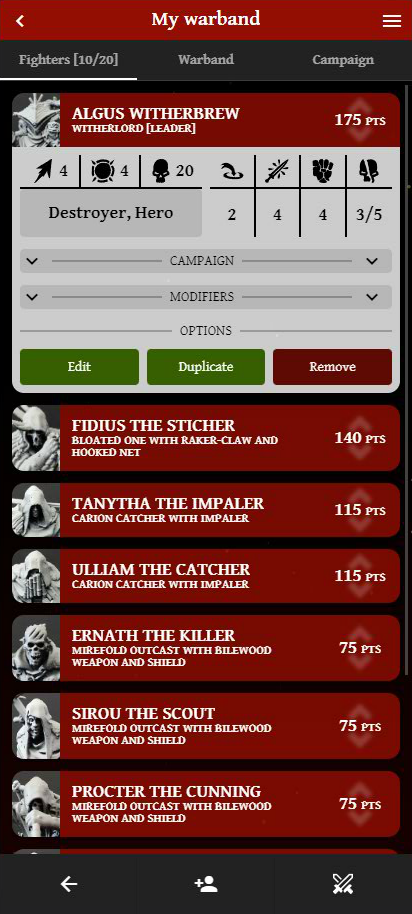

  You can edit/duplicate/remove the fighter by pressing on the corresponding Fighter card option.

  If you have multiple fighters you can also change the order of the Fighter cards by dragging them by their Points value on the right.

---

  
Warband Abilities Guide

---
  To add a Faction ability to a warband you should be on the Warband screen under the Warband tab. Here you can edit the warband's properties as well.
  Expand the Warband abilities and press on the add ability button.
  On the bottom action bar the button in the middle also lets you add a new ability.
  
  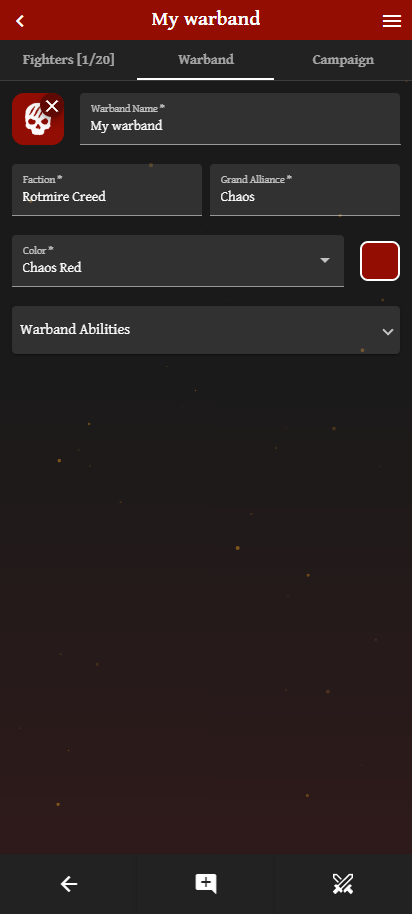 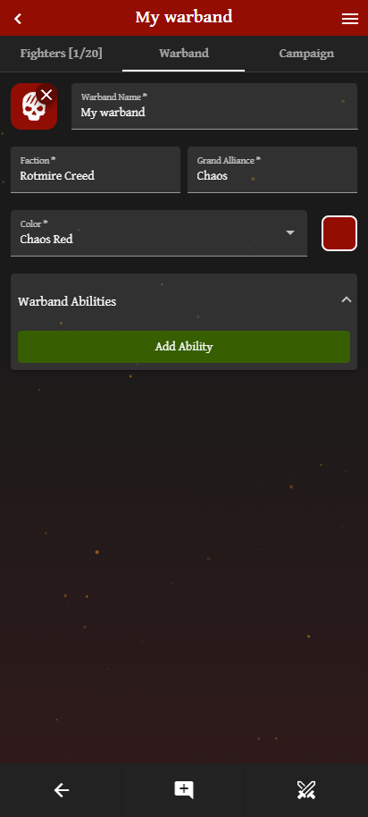

  If you select to add an ability to the warband the Ability dialog will show up. Now you will need to fill in the form with your ability's properties.
  
  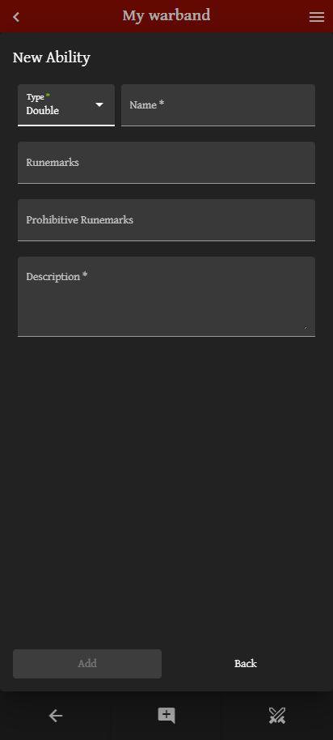 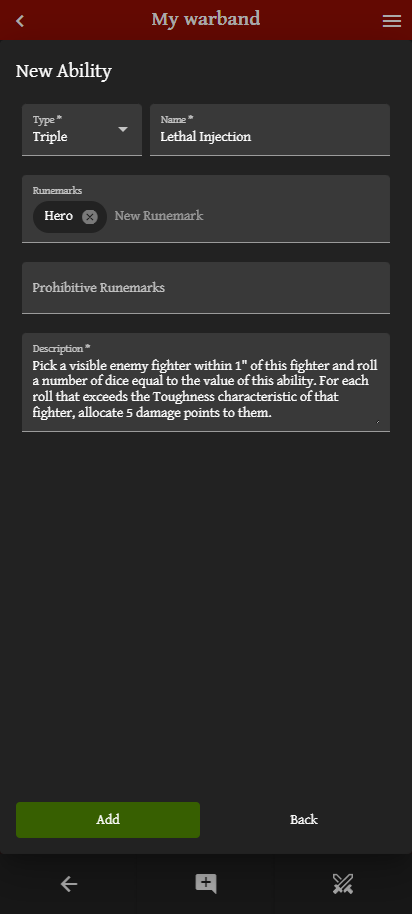

  After adding the ability its Ability card will appear on the Warband screen under the Warband tab in the Warband abilities expansion panel.
  You can edit//remove the ability by pressing on the corresponding button at the top right corner of the Ability card.

  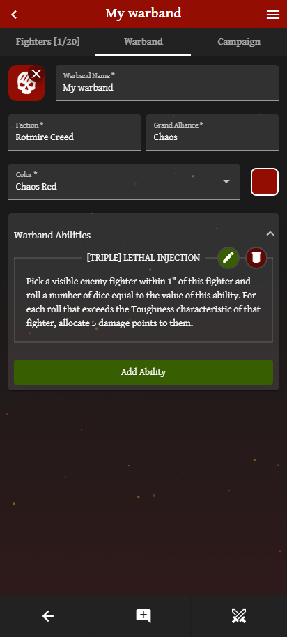

---

  
Narrative Play Guide

---
  You can record your narrative progress on the Warband screen under the Campaign tab.
  
  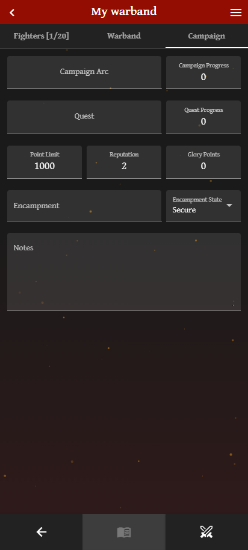 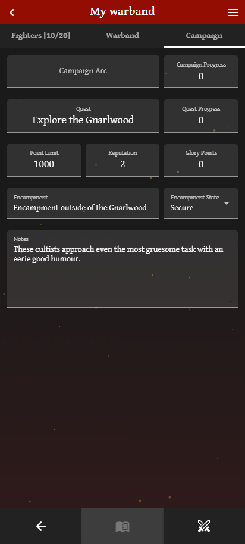
  
  You can record your fighter's narrative properties and modifiers (Artifacts, Traits and Injuries) on the Warband screen under the Fighters tab on the Fighter cards.
  
  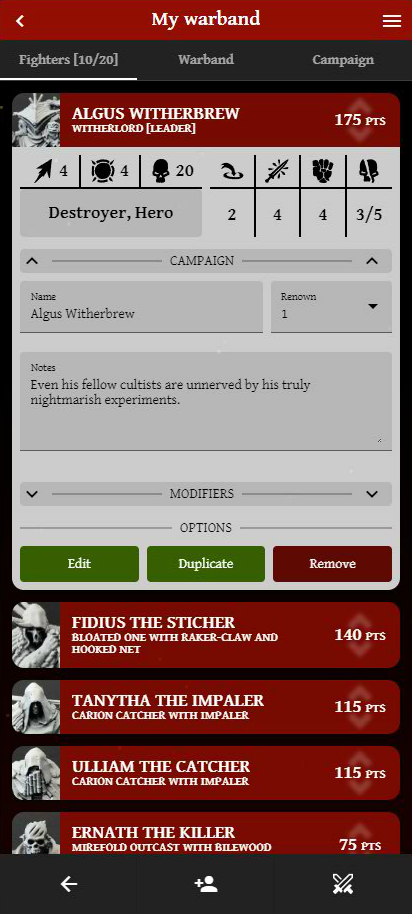 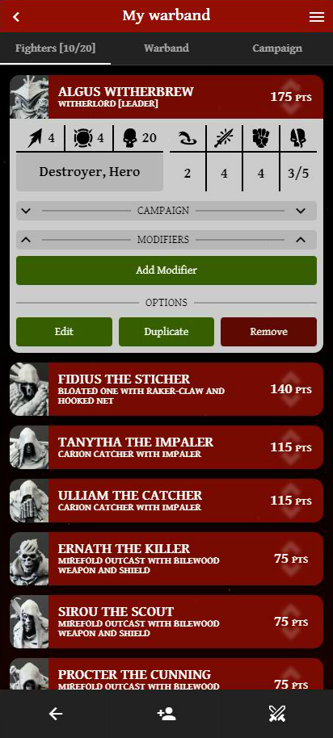
  
  If you select to add a modifier to the fighter the Modifier dialog will show up. Now you will need to fill in the form with your modifier's properties. If the chosen modifier changes the fighter's characteristics or weapons, replace the zeros with the modifying value. E.g. if the modifier would lower the toughness characteristic of the fighter by 1 then the value of the toughness modifier should be -1.
  
  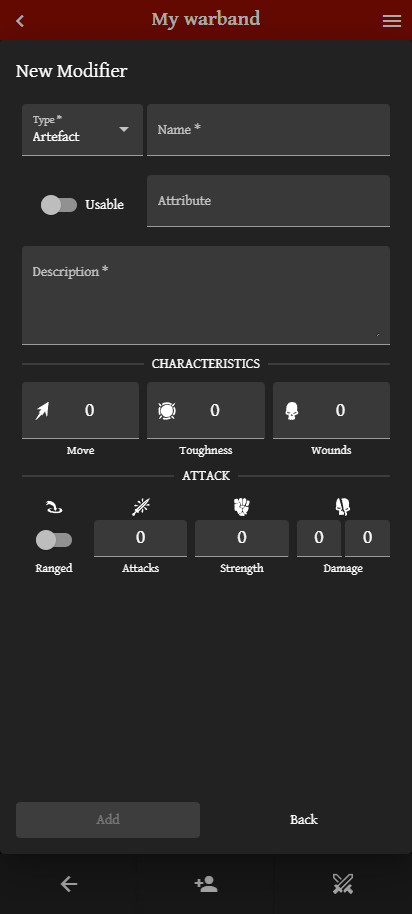 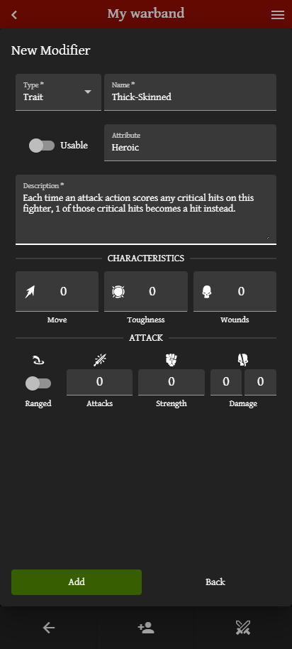

  After adding the modifier its Modifier card will appear on the Fighter card.
  You can edit/remove the modifier by pressing on the corresponding button at the top right corner of the Modifier card.

  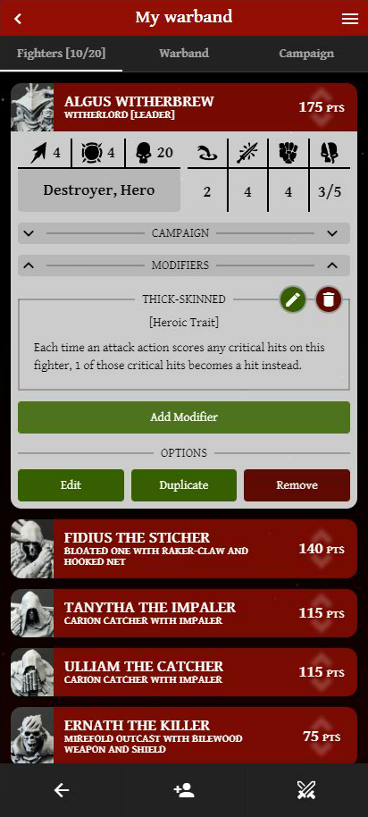

  You will have the option to choose to play a Narrative game on the Prepare for Battle dialog. While playing a Narrative game your warband's Point Limit will dictate how many points of fighters you can bring instead of the default 1000. Also your fighters will be affected by their modifiers.

  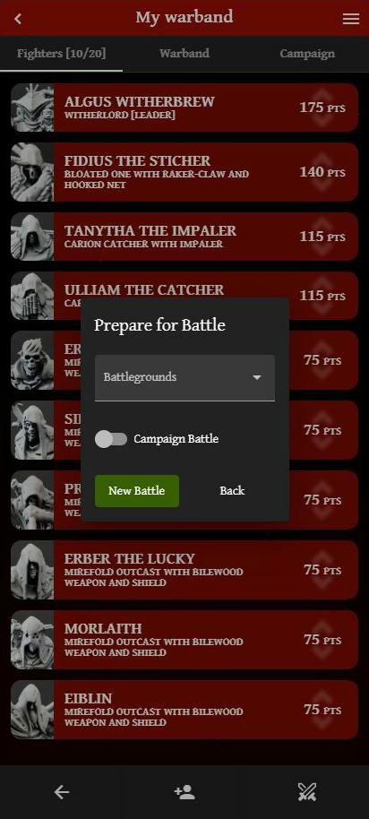 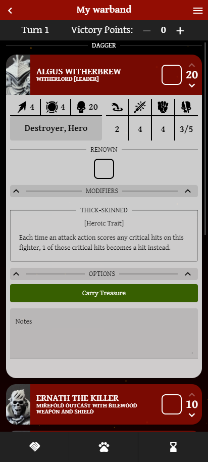

  On the screen menu pressing the battle logs or pressing the middle button on the bottom action bar will show you a log of previous battles (campaign and normal battles as well).

---

  
Universal Abilities and Battlegrounds Guide

---
  To add a Universal ability you should be on the Battlegrounds screen. You can navigate to the Battlegrounds screen from the Main screen by pressing the Battlegrounds option in the menu or by pressing the second button from the left on the bottom action bar.
  By default the Universal Abilities are displayed on the Battlegrounds screen. To add an ability press on the add ability button or the middle button on the bottom action bar.
  
   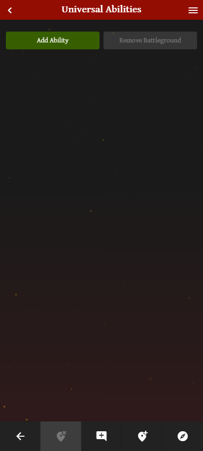

  If you select to add an ability the Ability dialog will show up. Now you will need to fill in the form with your ability's properties. To exclude some fighters from using the ability you can add one of their runemarks as a Prohibitive runemark.
  
   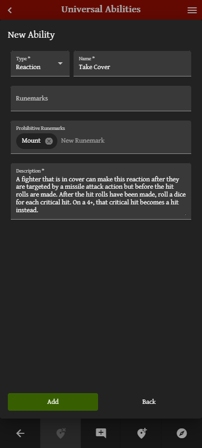

  After adding the ability its Ability card will appear on the Battlegrounds screen.
  You can edit//remove the ability by pressing on the corresponding button at the top right corner of the Ability card.

  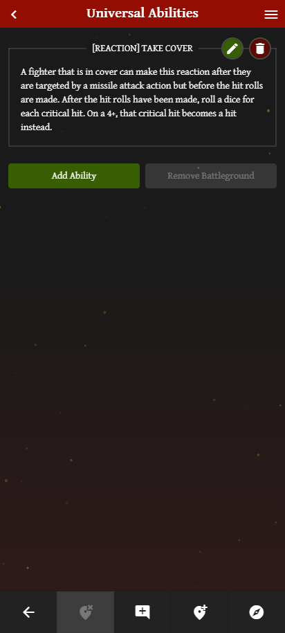

  You can add/select battlegrounds in the open the screen menu at the top right corner and select the select battleground option or the first button from the right on the bottom action bar. In the displayed submenu select the add battleground option to add a new battleground or select the name of a previously added battleground to display it. You can also add a battleground by pressing the second button from the right on the bottom action bar. To remove a battleground press on the remove battleground under the battleground abilities or the second button from the left on the bottom action bar. The Universal Abilities can not be removed, only the abilities inside it.
  
  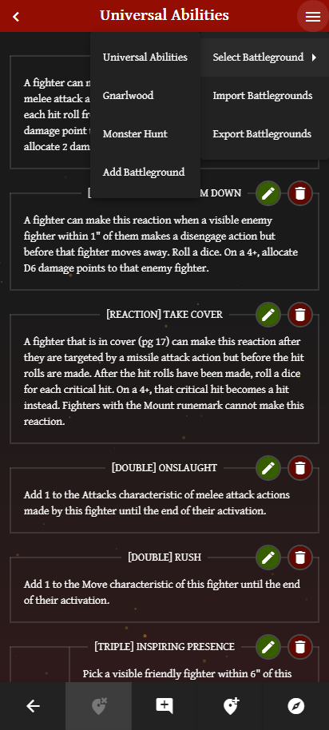 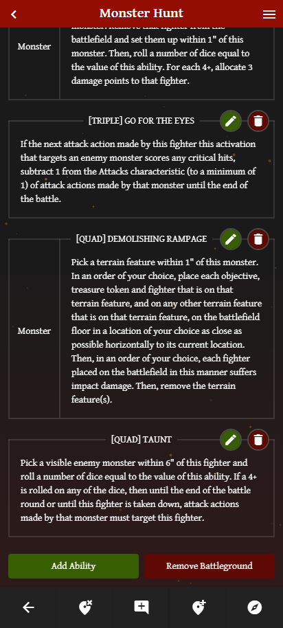

---

  
Battle Guide

---

### Battle options

  To start a battle you should be on the Main screen or a Warband screen. On the Main screen open the screen menu at the top right corner and select the quick battle option or pressing the right button on the bottom action bar. On the Warband screen open the screen menu at the top right corner and select the prepare for battle option or press the right button on the bottom action bar.
  
   

  If you select to start a quick battle or the prepare for battle option the Prepare for Battle dialog will show up. Now you will need to fill in the form with your choices.
  
  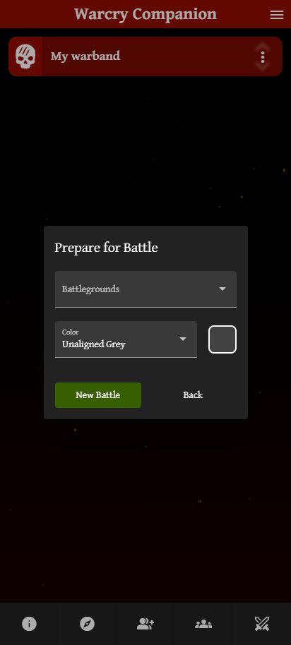 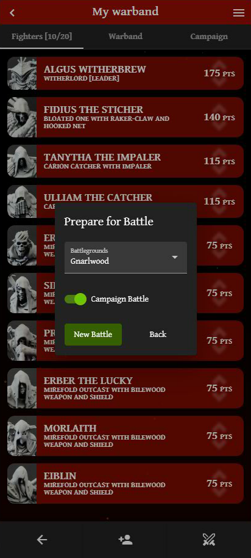

### Roster phase

  After pressing the new battle button you will arrive on the Battle screen in the Roster phase. Here you can drag and drop each fighter card to its desired battle group or expand the fighter card to press on one of the battle group buttons to put the fighter into the selected group.
  
  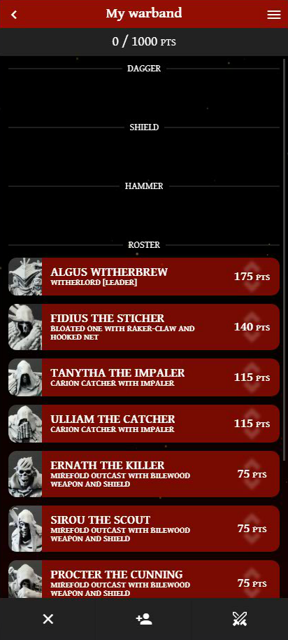 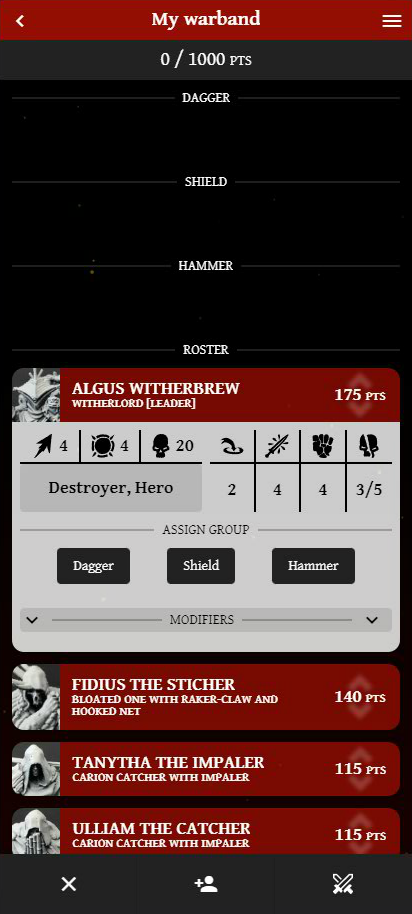

  During the placing of the fighters in the groups you can check if the selection of fighters does not exceed the Point limit on the top of the screen. If you are satisfied with the groups you can begin the battle, open the screen menu at the top right corner and select the begin battle option or press the right button on the bottom action bar.
  
  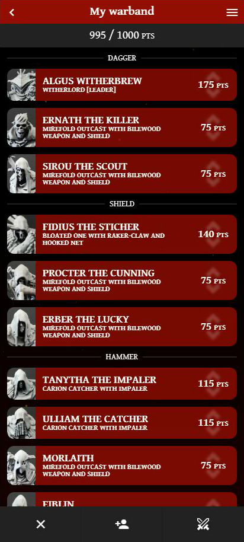 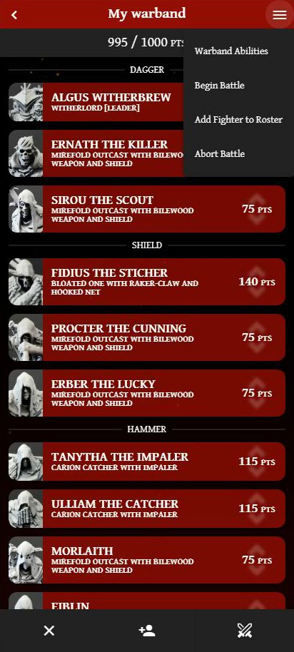

  On the screen menu pressing the begin battle or pressing the right button on the bottom action bar will begin the battle.

  On the screen menu pressing the add fighter to roster or pressing the middle button on the bottom action bar you can add a fighter to the roster. If you select to add fighter to roster the Fighter dialog will show up. Now you will need to fill in the form with your fighter's properties.

  On the screen menu pressing the abort battle or pressing the left button on the bottom action bar you can abort the battle. If you select to abort the battle you a dialog will show to confirm your decision. If you abort a battle there will be no records of it.

### Battle phase

  In the Battle phase you can see the turn counter on the top left, the Victory Points counter on the top right and the Fighter cards below, the Fighter cards are extended by the fighter's state marker and the fighter's remaining wounds counter on the top right of the card. On the expanded Fighter card if playing a campaign battle you can use a checkbox for each renown level to mark if you have used it in this battle, the fighter's modifiers are displayed, under its options you can set the fighter to carry/drop a treasure and take notes during the battle for the fighter.
  
  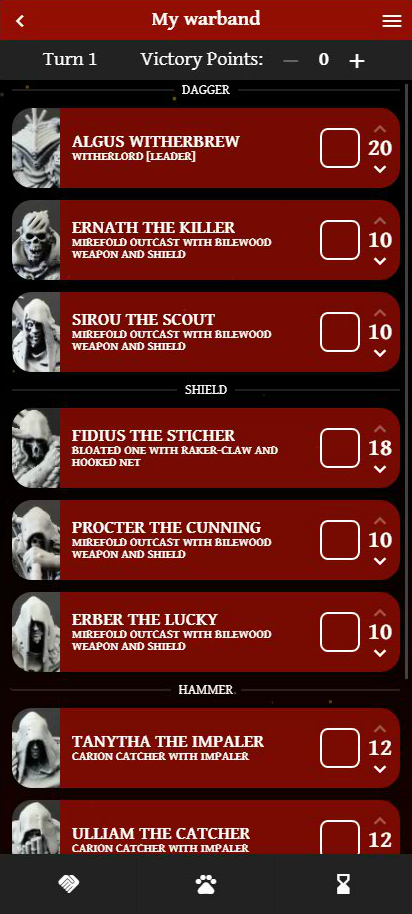 

  By pressing the fighter's runemarks on the expanded Fighter card you can see all of the available Reactions and Abilities for the fighter. Also if anything modifies the fighter's characteristics or weapon characteristics it will be shown on the Fighter Card.
  
  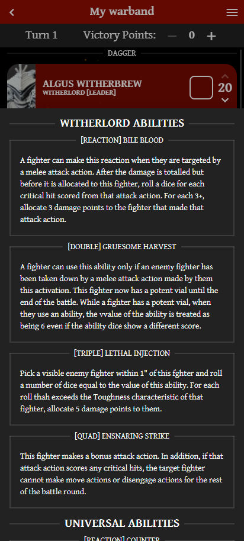 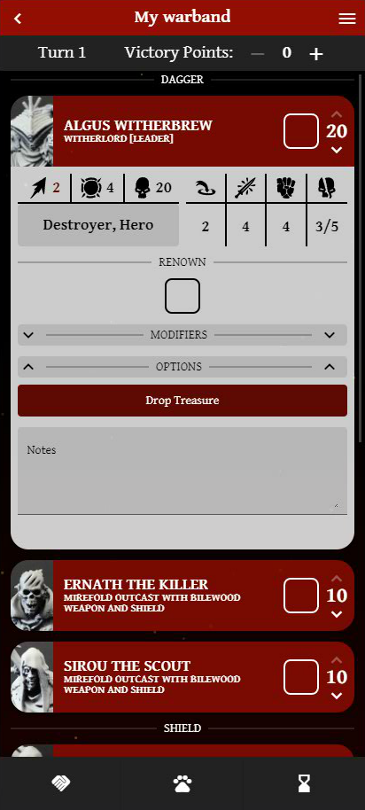

  You can set the fighter's state by pressing the fighter state marker (if the fighter is ready its an empty box) on the top right of the Fighter card. Right next to it you can keep track of the fighter's remaining wounds by increasing/decreasing the counter by the arrows above and below it. If a fighter's remaining wounds are 0 the fighter's state is automatically set Dead and the Fighter card becomes disabled.
  
  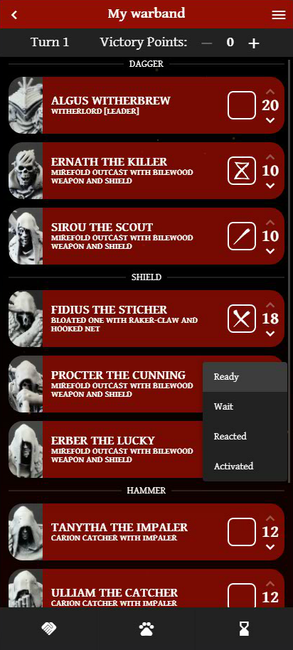 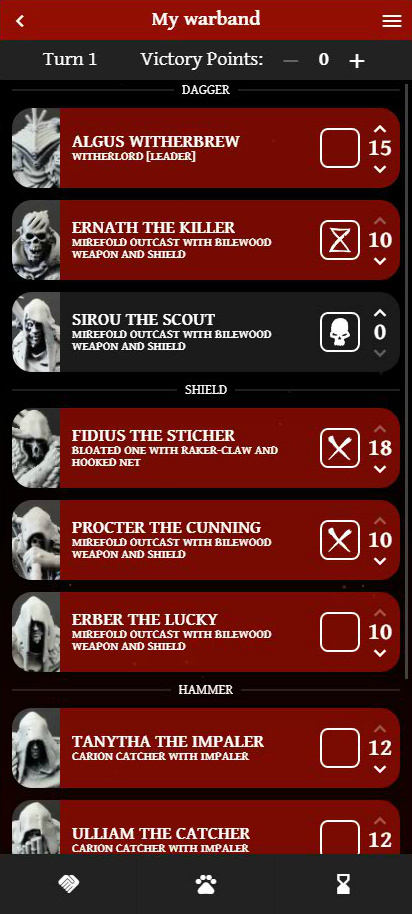

  You can keep track of the Victory Points by increasing/decreasing the counter by the arrows left and right from it. For all other options you need to open the screen menu or check the bottom action bar.

  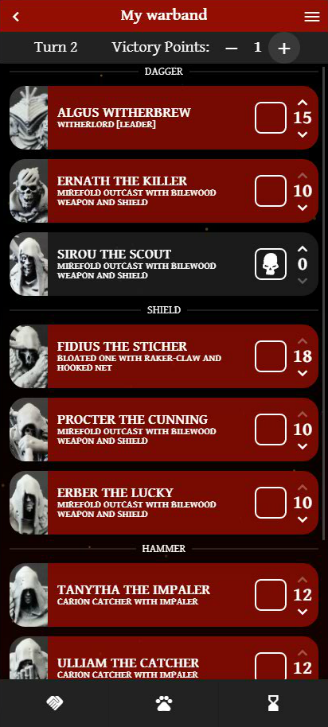 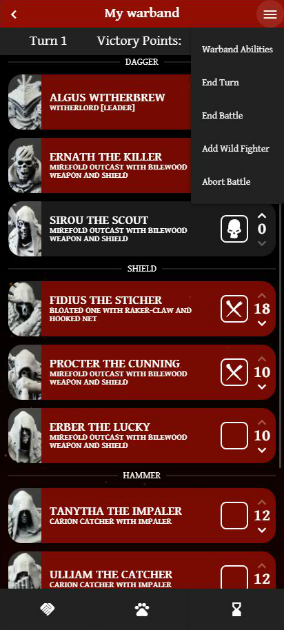

  On the screen menu pressing the end turn or pressing the right button on the bottom action bar you can end your turn. If there are fighters who are yet to use their full activation there will be a dialog displaying a list of them. You will still be able to end your turn after viewing this dialog. After starting a new turn a popup will show the current turn number.

  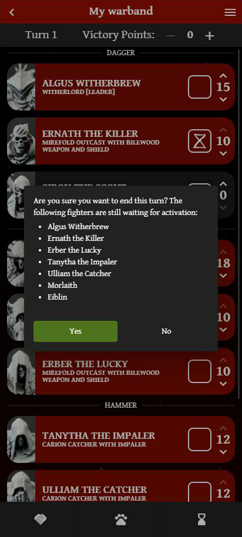 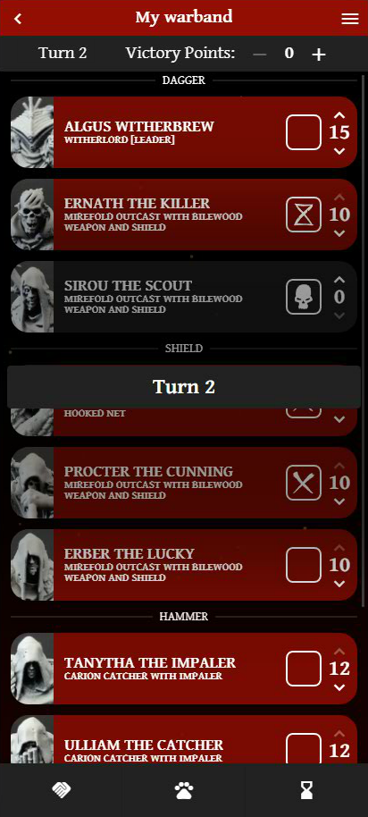

  On the screen menu pressing the end battle or pressing the left button on the bottom action bar you can end your the battle. If you select to end the battle the Ending battle dialog will show up. Now you will need to fill in the form with your battle result. You can also add the name of the opposing warband you have just fought against.

  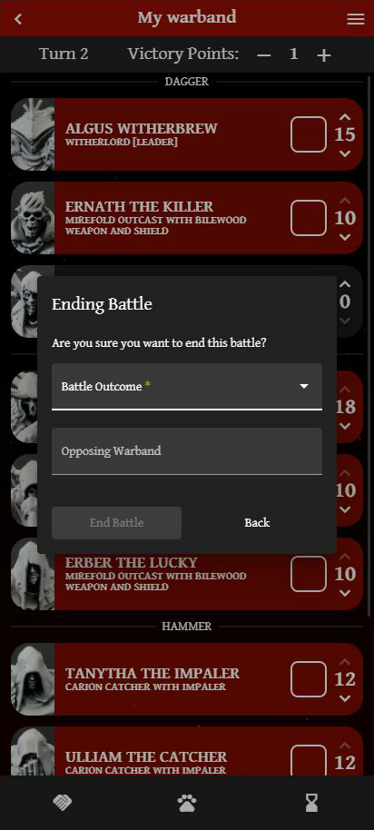 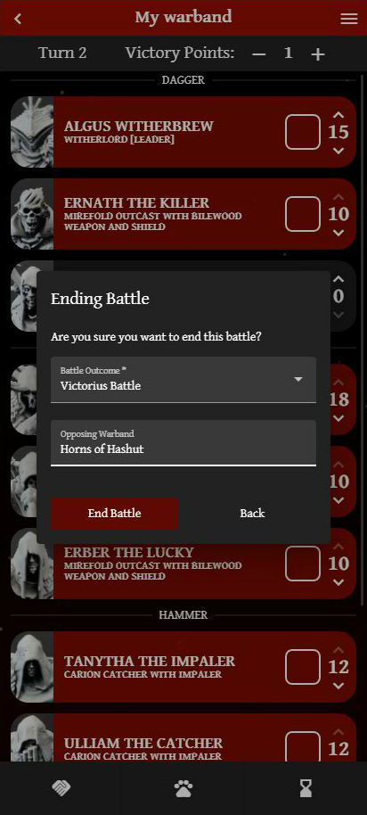

  On the screen menu pressing the abort battle option will abort your battle. If you select to abort the battle a dialog will show to confirm your decision. If you abort a battle there will be no records of it.

  On the screen menu pressing the add wild fighter or pressing the middle button on the bottom action bar you can add a wild fighter to the battle. If you select to add a wild fighter the Fighter dialog will show up. Now you will need to fill in the form with your fighter's properties.

---

  
Fighter Store

---
  You can navigate to the Fighter Store screen from the Main screen by pressing the Fighter Store option in the menu or by pressing the second button from the right on the bottom action bar. To add a fighter type to the Fighter Store on the screen menu press on the add fighter type option.
  You can also add a fighter type by pressing on the Fighter Store in the Fighter dialog on other screens and pressing save fighter to store.

  On this screen you can edit and remove fighter types the same way you can in the warbands screen under the fighters tab.

  You can load/update/remove a fighter type by pressing on the Fighter Store in the Fighter dialog on other screens and press the load/update/remove fighter from/in store.

  If you load a fighter type a new dialog will show up for you to select a fighter type. There is a filter on the top of the dropdown selection.

  You can update all fighters based on all of the fighter types in the Fighter Store by pressing update fighters in the warbands on the screen menu or pressing the right button on the bottom action bar.

  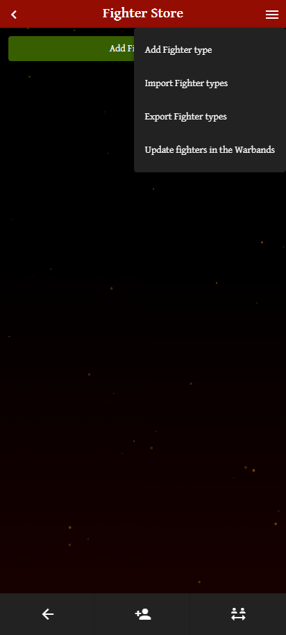 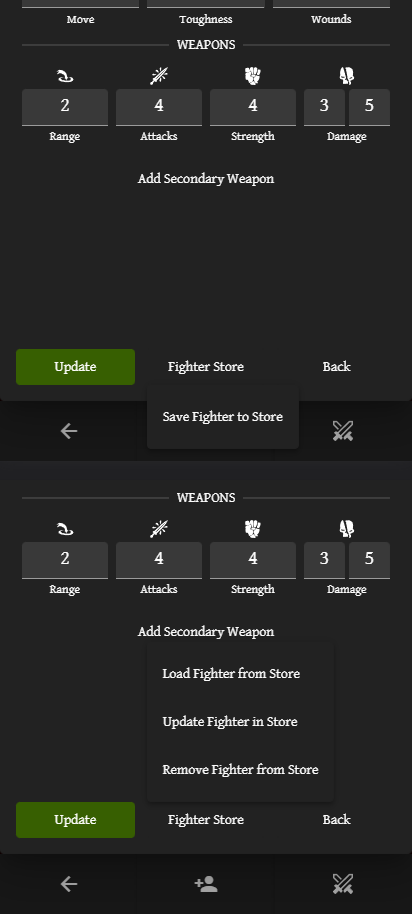
  

---

  
Special Fighter Roles

---
  A fighter with the Leader role should have the Hero runemark.

  A fighter with the Ally, Beast, Hero, Monster or Thrall roles should have a runemark representing their role.

  Fighters with the Ally, Monster, Thrall roles can have abilities.

  Fighters with the Monster role can have a damage table and can not have a secondary weapon. Their original characteristics and weapon characteristics should show the values when the Monster have at least 1 wound remaining. In the damage table each row should represent the minimum remaining wounds and the characteristics associated with them.

  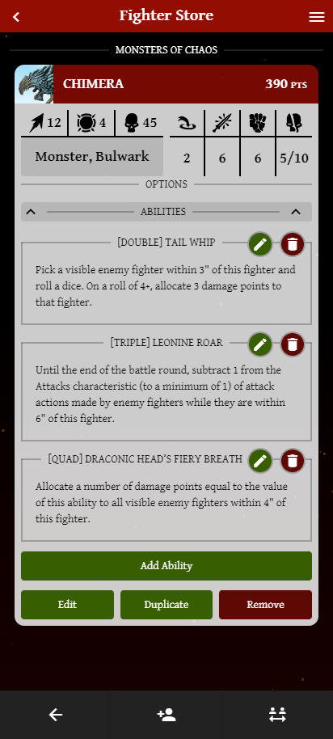 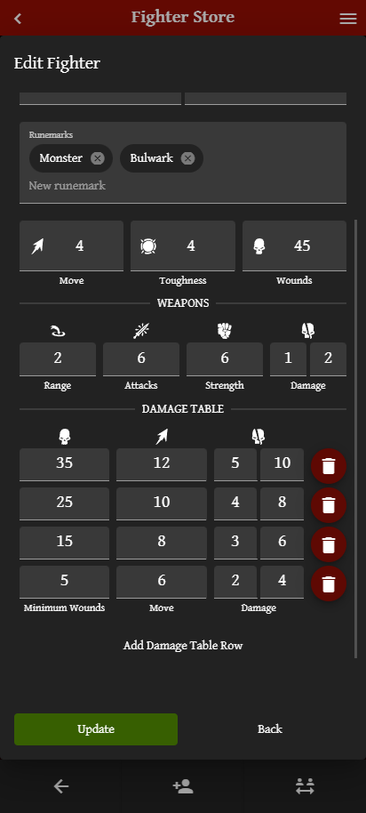
  

---

  
Import and export Guide

---
  To import a warband you should be on the Main screen, open the screen menu at the top right corner and select the import warband option.

  To export a warband you should be on the Main screen, open the Warband card options on the right end of the card and select the export warband option.

  To import battlegrounds you should be on the Battlegrounds screen, open the screen menu at the top right corner and select the import battlegrounds option.

  To export battlegrounds you should be on the Battlegrounds screen, open the screen menu at the top right corner and select the export battlegrounds option.

  To import fighter types you should be on the Fighter Store screen, open the screen menu at the top right corner and select the import fighter types option.

  To export fighter types you should be on the Fighter Store screen, open the screen menu at the top right corner and select the export fighter types option.
  

---

  
Install Guide

---
  If you want to install the app on your devices follow the following instructions:

#### On Computer

1. On your computer, open Chrome.
2. Go to the app using [this link](https://smitdcatchy.github.io/warcry-companion/).
3. At the top right of the address bar, click Install .
4. Follow the onscreen instructions to install the PWA.

#### On Android

1. On your Android device, open Chrome.
2. Go to the app using [this link](https://smitdcatchy.github.io/warcry-companion/).
3. Tap Install.
4. Follow the on-screen instructions.

#### Alternative method on Android

1. On your Android device, open Chrome.
2. Go to the app using [this link](https://smitdcatchy.github.io/warcry-companion/).
3. In the browser options menu tap on Add to Home Screen.
  

---

  
Online Battles

---
  To host an online battle you should be on the Battle screen in the Battle phase, open the screen menu at the top right corner, select the online battles submenu or the second button from the right on the bottom action bar and select the copy battle token option. Share this token with your opponents.

  To join an online battle you should be on the Battle screen in the Battle phase, open the screen menu at the top right corner, select the online battles submenu or the second button from the right on the bottom action bar and select the join a running battle option. If you select to join a running battle the Join Battle dialog will show up. Now you will need to fill in the form with your opponent's Battle token and press join.

  To check other warbands in the online battle you should be on the Battle screen in the Battle phase and hosting or joined an online battle, open the screen menu at the top right corner, select the online battles submenu or the second button from the right on the bottom action bar and select the desired warband.

  To leave an online battle you should be on the Battle screen in the Battle phase and hosting or joined an online battle, open the screen menu at the top right corner, select the online battles submenu or the second button from the right on the bottom action bar and select leave the running battle option.

---

If you have any questions left follow [this link](https://github.com/SmitdCatchy/warcry-companion/discussions/categories/q-a) and start a discussion about it.
